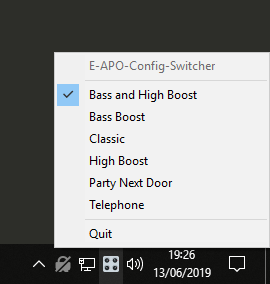

# 🎛️ EACS - Equalizer APO Config Switcher

A small Windows tray app that allows you to quickly switch between using different [Equalizer APO](https://sourceforge.net/projects/equalizerapo/) configuration files

Inspired by [Peace](https://sourceforge.net/projects/peace-equalizer-apo-extension/)

## Features

- Right click on the tray icon to bring up the menu
- The tray icon is dimmed when there are no active configurations
- Enable and disable configurations by clicking them (you can have as many enabled as you want)
- Edit, add, and remove configurations just by changing `.txt` files
- Everything happens in the system tray, keeping things simple

## Warnings

- This won't work alongside other configuration programs such as Peace or the default configuration program that comes with Equalizer APO
- This will overwrite Equalizer APO's `config.txt`. Make a backup if you need to!

## Install

- Download the latest `EACS.zip` from [releases](https://github.com/psidex/EACS/releases/latest)
- Extract it to `<Equalizer APO install location>\EqualizerAPO\config`
- Run `EACS.exe` that is now inside `config\EACS`
- You should now have the icon in your system tray, you can now left/right click on it to switch configurations
- If you want it to run on system startup, create a shortcut to the exe and move it to the Windows startup directory (`%USERPROFILE%\Start Menu\Programs\Startup`)

## Edit / Add / Remove Configurations

The folder that contains all the configuration files will be located at `EqualizerAPO\config\EACS\config-files`

See [the user guide](./GUIDE.md) for more detailed information

# Credit

Icon is the [Control Knobs](https://emojipedia.org/control-knobs/) emoji from [Twitter](https://twemoji.twitter.com/)
