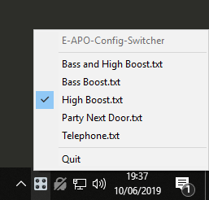

# E-APO-Config-Switcher

A small Windows app that sits in the tray and allows you to quickly switch between using different [Equalizer APO](https://sourceforge.net/projects/equalizerapo/) configuration files

There are a couple of limitations that come with using this app:
- You cannot manually edit your Equalizer APO configuration. If you do, it will be erased
- This will not work alongside other configuration programs, such as Peace

## Install

- Download the latest `E-APO-Config-Switcher.zip` from [releases](https://github.com/psidex/E-APO-Config-Switcher/releases/latest)
- Extract it to `<Equalizer APO install location>\EqualizerAPO\config`
- Run `E_APO_Config_Switcher.exe` (in the same directory as the install script)
- You should now have an icon in your system tray that you can click on
- If you want it to run on system startup, create a shortcut to the exe and move it to the windows startup directory

## Screenshot

## Credits

- [zserge/tray](https://github.com/zserge/tray) to handle the system tray interaction
- Inspired by [Peace](https://sourceforge.net/projects/peace-equalizer-apo-extension/)
